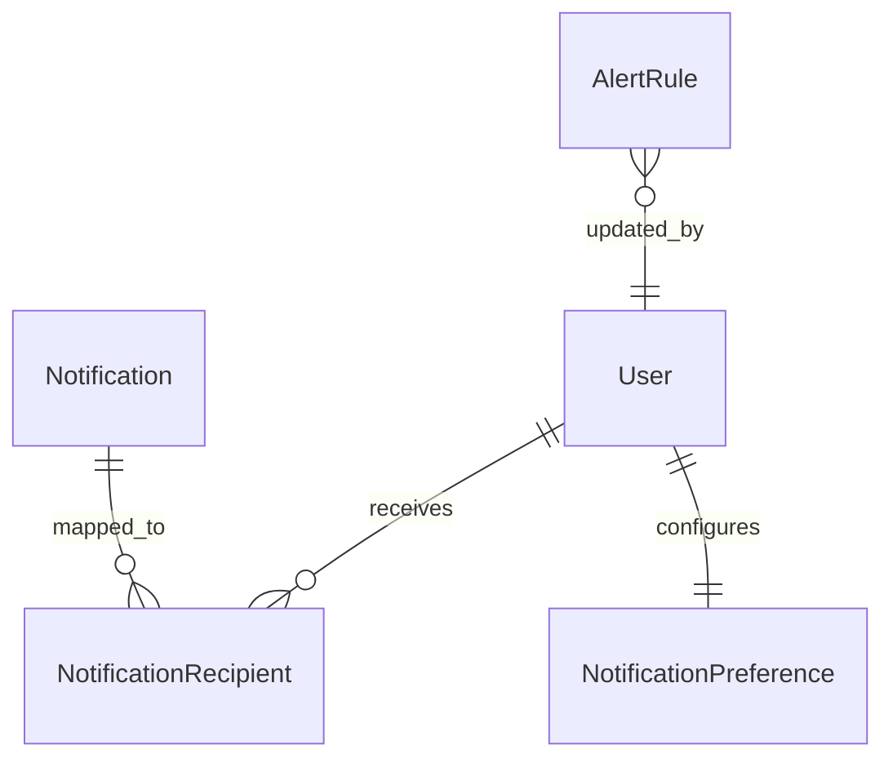

# Data Model Design: Notifications and Alerts

This document describes the Prisma schema modifications and database models required for the Notifications and Alerts module.

---

## 1. Prisma Schema Modifications

The following models and enums will be appended to [schema.prisma](file:///f:/CodingProjects/PinoProductionSys/prisma/schema.prisma):

```prisma
// ==========================================
// Notifications & Alerts Models
// ==========================================

model Notification {
  id                String                  @id @default(cuid())
  title             String
  message           String
  category          NotificationCategory
  severity          NotificationSeverity
  relatedEntityType String?                 // e.g. "ProductionOrder", "Batch", "InventoryItem"
  relatedEntityId   String?                 // ID of the linked entity for click-through navigation
  createdAt         DateTime                @default(now())
  recipients        NotificationRecipient[]

  @@index([category])
  @@index([severity])
  @@index([createdAt])
  @@map("notifications")
}

model NotificationRecipient {
  notificationId String
  userId         String
  isRead         Boolean      @default(false)
  readAt         DateTime?
  isArchived     Boolean      @default(false)
  archivedAt     DateTime?
  notification   Notification @relation(fields: [notificationId], references: [id], onDelete: Cascade)
  user           User         @relation(fields: [userId], references: [id], onDelete: Cascade)

  @@id([notificationId, userId])
  @@index([userId, isRead, isArchived])
  @@map("notification_recipients")
}

model AlertRule {
  id               String               @id @default(cuid())
  name             String               @unique
  category         NotificationCategory
  triggerType      AlertTriggerType
  parameters       Json                 // JSON structure storing thresholds (e.g. { "daysBefore": 7 })
  severity         NotificationSeverity
  targetRoles      String[]             // Role names that should receive alerts generated by this rule
  isEnabled        Boolean              @default(true)
  createdAt        DateTime             @default(now())
  updatedAt        DateTime             @updatedAt
  updatedById      String?

  @@map("alert_rules")
}

model NotificationPreference {
  id               String   @id @default(cuid())
  userId           String   @unique
  user             User     @relation(fields: [userId], references: [id], onDelete: Cascade)
  inventoryAlerts  Boolean  @default(true)
  batchAlerts      Boolean  @default(true)
  productionAlerts Boolean  @default(true)
  systemAlerts     Boolean  @default(true)
  createdAt        DateTime @default(now())
  updatedAt        DateTime @updatedAt

  @@map("notification_preferences")
}

enum NotificationCategory {
  PRODUCTION
  INVENTORY
  BATCH
  WAREHOUSE
  SYSTEM
}

enum NotificationSeverity {
  INFO
  WARNING
  CRITICAL
}

enum AlertTriggerType {
  LOW_STOCK
  NEGATIVE_INVENTORY
  NEAR_EXPIRY
  EXPIRED_BATCH
  PRODUCTION_DELAY
}
```

---

## 2. Relationships



- **User / NotificationRecipient**: A User can receive multiple notifications. The `NotificationRecipient` table tracks status per recipient.
- **User / NotificationPreference**: A User has exactly one set of notification preferences. Deleting a `User` cascades and deletes their preferences.
- **Notification / NotificationRecipient**: A single notification payload is stored once in `Notification` and linked to one or more user recipients in `NotificationRecipient` (supporting broadcast/role-based targeting).
- **Cascade Deletes**: Deleting a `Notification` automatically cascades and deletes all related `NotificationRecipient` records. Deleting a `User` cascades and deletes their corresponding recipient records.

---

## 3. Indexing & Optimization Strategy

- **Header Bell Count**: To retrieve the unread count in under 200ms, a composite index is created on `NotificationRecipient`: `@@index([userId, isRead, isArchived])`. This allows fast queries of the form:
  ```sql
  SELECT COUNT(*) FROM notification_recipients WHERE userId = $1 AND isRead = false AND isArchived = false;
  ```
- **History List Pagination**: An index on `Notification(createdAt)` ensures sorting is fast for paginated lists.
